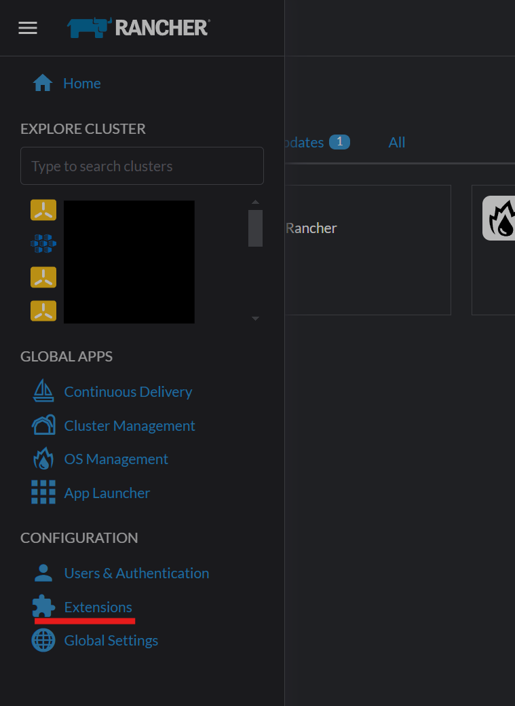
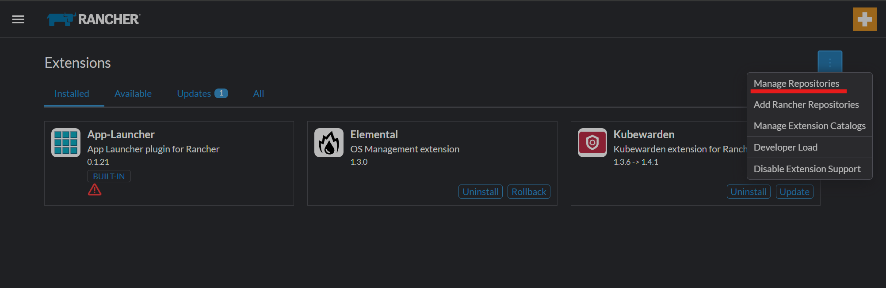
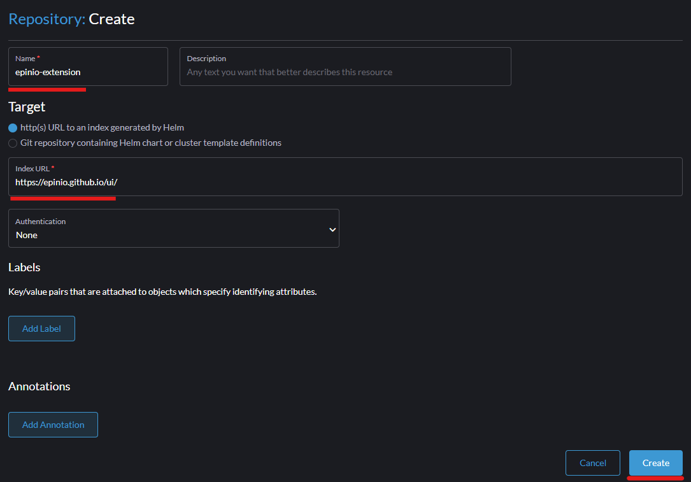
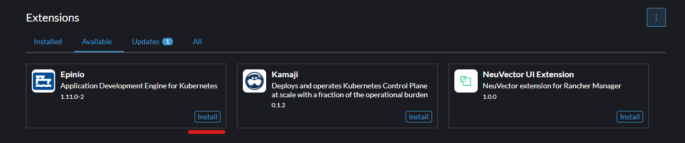
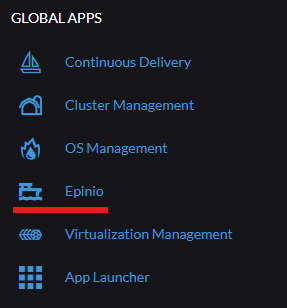

This is the Rancher Application Shell (created via https://rancher.github.io/dashboard/extensions/extensions-getting-started#creating-the-application)

The Epinio UI is an extension of Rancher and can be in `pkg/epinio`. This one extension powers both embedded and standalone forms of the UI. For more information see root README.

## Getting Started - Run in Standalone Mode

### UI Backend
Run the UI backend as per [./backend/README.md](../backend/README.md)

### UI Frontend

#### Dependencies
Node 16.15.0 or lower, `yarn`

#### Run
1) UI Dev Only Step - Setup the Rancher Dashboard repo
   - Clone https://github.com/rancher/dashboard and checkout `epinio-dev`
   - Run `cd shell && yarn link`
1) Clone https://github.com/epinio/ui and checkout `main`
1) UI Dev Only Step - Link in Rancher Dashboard packages
   - Run `cd <epini/ui root>/dashboard && yarn link @rancher/shell`
1) Run `yarn install`
1) Run `EXCLUDES_PKG=harvester,rancher-components EXCLUDE_OPERATOR_PKG=true RANCHER_ENV=epinio API=https://localhost:5443 yarn dev`

## Getting Started - Extension

### Installation

To install the extension, you will need Rancher 2.7.6 or later.

1. Go to the Rancher dashboard (as an administrator)

2. Open the hamburger menu in the top left corner, and select Extensions

3. Open the dropdown in the top right corner and select "Manage Repositories"

4. Click Create

5. Enter the repository information

    a. Name: `epinio-extension`

    b. http(s) URL to an index generated by helm

    c. Index URL: `https://epinio.github.io/ui/`

    d. Authentication: None

6. Return to the Extensions page

7. Click the Available tab

8. Install the Epinio extension

9. Epinio will now be available in the Global Apps list

